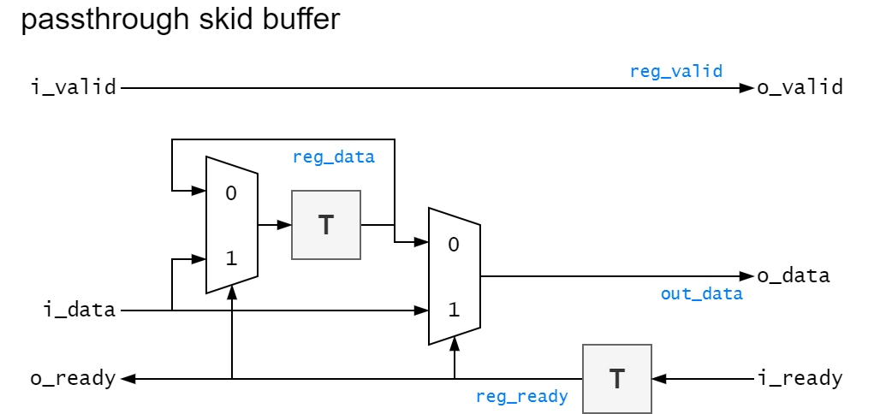
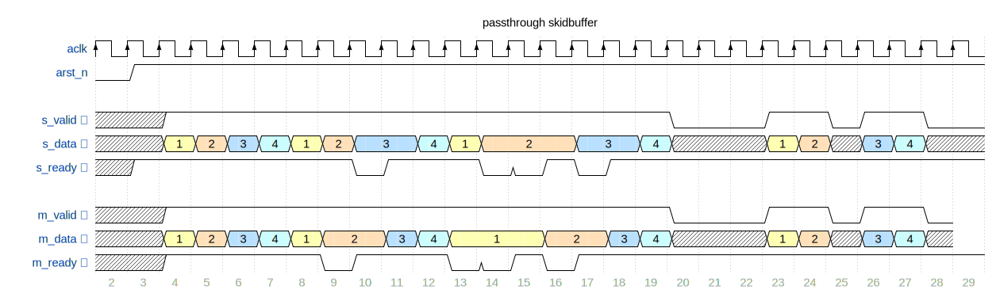
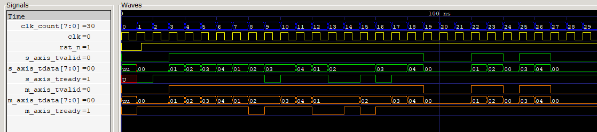
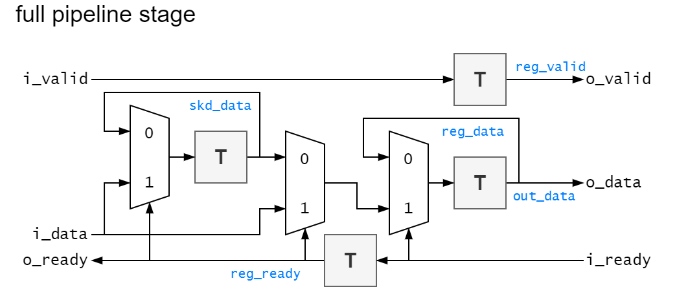
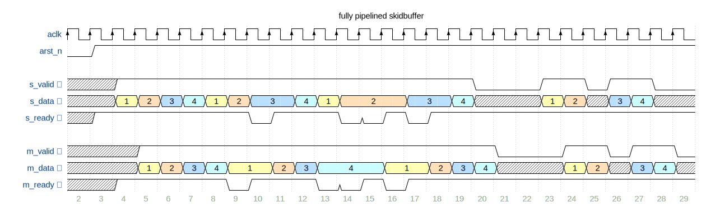
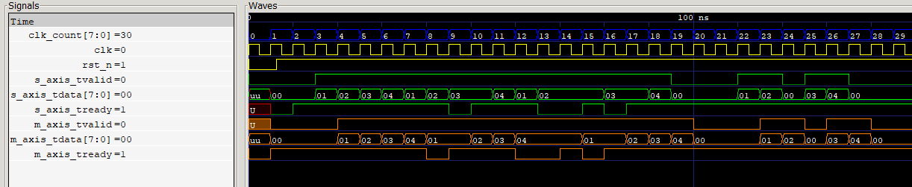

# AXI Stream compatible Skidbuffer in VHDL

# Idea

## Passthrough Skid Buffer

Only the reply signal from downstream slave to upstream master (`tready`) is pipelined.

All other signals from upstream master to downstream slave (`tvalid`, `tdata`, `tlast`) are *combinatorial*.
It therefore has 0 latency in the best case and maximum 1 clock cycle latency in case of a stall.
However, it increases combinatorial logic in the master -> slave path which can make it harder to meet timing requirements.

### Schematic


### Waveform



## Fully Pipelined Skid Buffer

With registered outputs for all signals.
It therefore has a minimum latency of 1 clock cycle and a maximum of 2 clock cycles in case of a stall.
This is a pipeline register to help reach timing closure.

### Schematic


### Waveform



# Simulation

Assuming `ghdl` and `gtkwave` installed on Windows.

Run in powershell:

```batch
.\compile.bat
```

# Acknowledgements

https://zipcpu.com/blog/2019/05/22/skidbuffer.html


### Anti-Acknowledgements

This article did **NOT** help: it is confusing since the code does not match the schematic.

https://www.itdev.co.uk/blog/pipelining-axi-buses-registered-ready-signals


