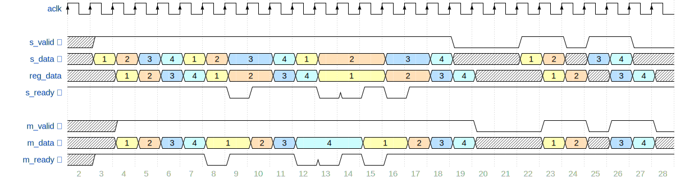

# AXI Stream compatible Skidbuffer in VHDL

# Idea




# Simulation

Assuming `ghdl` and `gtkwave` installed on Windows.


```batch
.\compile.bat
```


# Acknowledgements

https://zipcpu.com/blog/2019/05/22/skidbuffer.html


